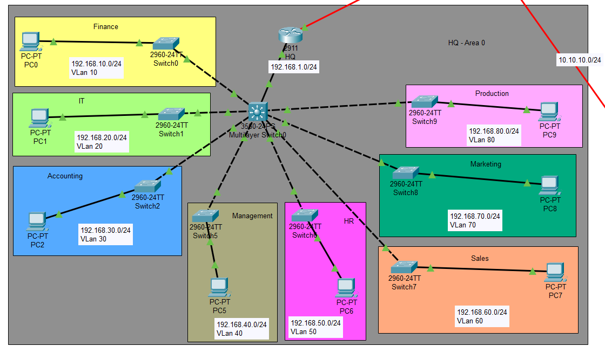
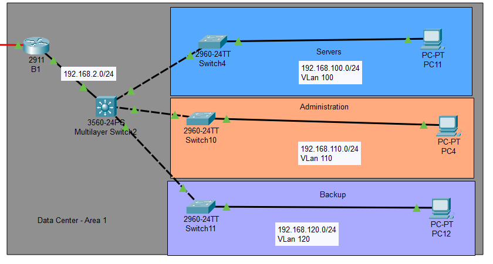
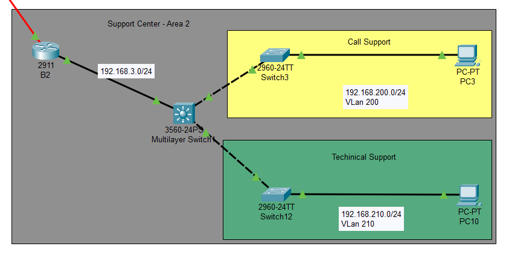
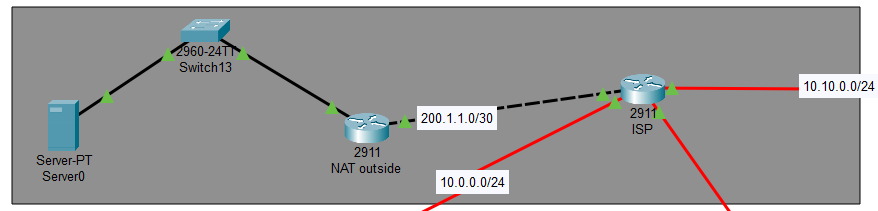

# 🏢 Company Network Infrastructure with VPN, NAT & OSPF Multi-Area

## 📘 Project Overview

This graduation project simulates the **network infrastructure of a company with two branches** using **Cisco Packet Tracer**. The goal is to create a functional, secure, and scalable network using CCNA and CCNP Enterprise Core concepts. The setup includes **VLANs**, **inter-VLAN routing**, **multi-area OSPF**, **VPNs**, **NAT**, and **DHCP services**.

---

## 🧰 Technologies Used

- Cisco Packet Tracer
- Routing Protocol: **OSPF Multi-Area**
- VLANs & Inter-VLAN Routing
- DHCP (on Layer 3 Switches)
- NAT (Network Address Translation)
- VPN (HQ ↔ Branch 1 & HQ ↔ Branch 2)
- ACLs for VPN traffic

---

## 🏗️ Network Topology Overview

The network consists of a **Headquarters (HQ)** and two branches (**Branch 1** and **Branch 2**), all connected through an **ISP router**. Each site has its own VLANs, with Layer 3 switches managing routing and DHCP services. A simulated public server is connected via NAT through the ISP cloud.

### 🧩 VLAN Design

| Location    | VLANs                                                                              | Subnets                        |
|-------------|-------------------------------------------------------------------------------------|--------------------------------|
| **HQ**      | Finance (10), IT (20), Accounting (30), Management (40), HR (50), Sales (60), Marketing (70), Production (80) | 192.168.10.0/24 → 192.168.80.0/24 |
| **Branch 1**| Servers (100), Administration (110), Backup (120)                                  | 192.168.100.0/24 → 192.168.120.0/24 |
| **Branch 2**| Tech Support (200), Call Support (210)                                              | 192.168.200.0/24 → 192.168.210.0/24 |

- Each VLAN has a switch and a PC
- DHCP is handled by the local Layer 3 switch
- Gateway IP for each VLAN is `.2` (e.g., `192.168.10.2`)

---

## 🔧 Configuration Steps

1. **Topology Design**
   - Built the logical/physical topology using routers, L3/L2 switches, PCs, and an ISP cloud.

2. **VLANs & Inter-VLAN Routing**
   - VLANs created and assigned to access ports.
   - Trunks configured between L2 and L3 switches.
   - SVIs on L3 switches set to `.2` for gateway addresses.

3. **DHCP Setup**
   - Configured per VLAN on Layer 3 switches.
   - Default-router corrected from `.1` to `.2`.

4. **OSPF Multi-Area Routing**
   - HQ in **Area 0 (Backbone)**.
   - Branch 1 in **Area 1**.
   - Branch 2 in **Area 2**.

5. **VPN Configuration**
   - Site-to-site VPNs established:
     - HQ ↔ Branch 1
     - HQ ↔ Branch 2
   - ACLs configured for interesting traffic.

6. **NAT Configuration**
   - Configured on ISP router.
   - NAT allows internal hosts to reach a simulated public server.

---

## 🧪 Testing & Validation

Testing was performed using:
- `ping` across VLANs and branches
- `show ip route`, `show ip ospf`, and VPN debug commands
- DHCP lease validation
- VPN traffic simulation and NAT translation checks

---

## ✅ Results

- **VLANs & DHCP**: All devices received IP addresses and default gateway correctly.
- **Routing**: OSPF multi-area worked with full route exchange.
- **VPN**: Secure tunnels between HQ and both branches successfully created.
- **NAT**: Proper translation observed on public server access.

---

## 🧠 Challenges & Fixes

- **DHCP Default Gateway Issue**: Initially configured as `.1`, but changed to `.2` to match L3 switch interfaces.
- **VPN Misconfiguration**: Required debugging of commands and ACLs; solved after several trials.

---

## 🔮 Future Improvements

- Add more end devices (e.g., additional PCs, printers)
- Configure **phones & DSL** in the Call Support VLAN
- Integrate basic **network monitoring tools**
- Add **redundancy** and **firewall ACLs**

---

## 🖼️ Project Files & Diagrams

- [`1-Topology.pkt`](./FinalProject_Topology.pkt)
- [`2-InterVLAN.pkt`](./FinalProject_Vlans.pkt)
- [`3-DHCP.pkt`](./FinalProject_DHCP.pkt)
- [`4-Routing.pkt`](./FinalProject_OSPF.pkt)
- [`5-VPN.pkt`](./FinalProject_VPN.pkt)
- [`6-NAT.pkt`](./FinalProject_NAT.pkt)

### 🔧 Topology Screenshots

#### 🏢 HQ Setup

#### 🏬 Branch 1

#### 🏬 Branch 2

#### 🌐 ISP & Server Configuration

---

## 📄 Final Notes

This project is part of a **graduation requirement for DEPI program** and demonstrates hands-on skills in building secure and scalable networks using Cisco best practices.

---

